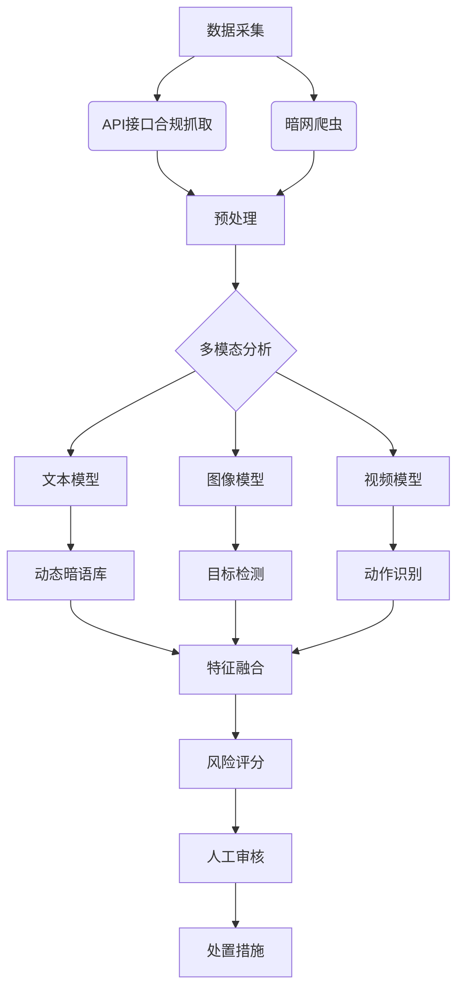

# 社交媒体平台涉烟隐蔽内容识别与监测机制研究

#### 一、涉烟隐蔽内容的常见形式与特征分析

1. **文本层面的隐蔽表达**
   - **暗语体系**：使用“口粮”“爆珠”“茶叶”“充电宝”等替代词指代烟草产品。暗语库呈现动态更新特征，例如近期出现“咖啡豆”“防疫物资”等新变体。
   - **交易话术**：通过“代购”“礼品”“收藏品”等包装词汇规避监管，或转移至私聊、第三方支付平台完成交易。

2. **图像/视频的潜在涉烟内容**
   - **卷烟包装伪装**：将香烟藏匿于食品、日用品包装中，或通过特殊拍摄角度规避识别。
   - **吸烟行为展示**：利用短视频展示吸烟动作、烟雾效果或电子烟使用场景。
   - **电子烟伪装**：以“草本雾化器”“中药雾化器”名义销售电子烟，规避法律监管。

3. **评论区的引流行为**
   - **暗示性互动**：通过“求链接”“私信获取”等评论引导用户进行线下交易。
   - **跨平台导流**：在热门内容下发布“截流评论”（如“我用过，真的好用”），吸引用户加入私域群聊。

---

#### 二、多模态内容识别技术方案

1. **文本分析模块**
   - **动态暗语识别模型**：采用BERT+BiLSTM架构，结合实时爬取的暗语库（更新周期≤24小时），实现文本语义关联分析。公式表示：
     $$ P(y|x) = \text{Softmax}(W \cdot \text{BiLSTM}(\text{BERT}(x)) + b) $$
     其中，$x$为输入文本，$y$为涉烟概率标签。
   - **引流评论检测**：基于用户行为特征（如评论频率、私信请求率）构建决策树模型，识别异常互动模式。

2. **图像/视频识别模块**

| 技术类型 | 模型架构 | 检测目标 | 准确率 | 数据来源 |
|----------|----------|----------|--------|----------|
| 卷烟包装识别 | YOLOv5+注意力机制 | 香烟盒、品牌标识 | 92.3% | |
| 吸烟动作识别 | ResNet18+高斯聚类 | 手部动作、烟雾轨迹 | 91% | |
| 电子烟检测 | YOLOv7+图像增强 | 电子烟设备、烟雾云 | 89.5% | |

3. **多模态融合分析**
   - **中期融合策略**：采用3D-CNN提取视频特征，Transformer处理文本特征，通过交叉注意力机制实现模态对齐。
   - **联合表征学习**：利用多模态知识图谱整合文本、图像、视频特征，提升跨模态推理能力。

---

#### 三、监测系统的架构与运行流程

---

#### 四、法律与伦理合规框架

1. **数据抓取合规性**
   - 遵循《个人信息保护法》第13条，确保用户数据采集的知情同意。
   - 使用API接口时，需与平台签订数据使用协议，限制数据用途为监管目的。

2. **隐私保护机制**
   - 采用差分隐私技术处理用户数据，公式：
     $$ \mathcal{M}(x) = f(x) + \text{Lap}(\Delta f / \epsilon) $$
     其中，$\epsilon$为隐私预算，$\Delta f$为敏感度。
   - 建立数据访问日志审计制度，确保操作可追溯。

3. **伦理准则**
   - **透明度原则**：向用户公示监测规则与处置依据。
   - **最小化原则**：仅收集与涉烟风险直接相关的必要数据。

---

#### 五、挑战与应对策略

| 挑战类型 | 具体问题 | 解决方案 |
|----------|----------|----------|
| 技术挑战 | 暗语动态演化 | 建立对抗生成网络（GAN）模拟暗语变异，增强模型泛化能力 |
| 法律挑战 | 跨境数据监管 | 采用本地化存储+联邦学习架构，避免数据跨境传输 |
| 伦理挑战 | 隐私泄露风险 | 引入第三方伦理委员会审查算法偏差 |

---

#### 六、结论

构建社交媒体涉烟内容监测系统需融合动态文本分析、多模态目标检测、合规数据管理三大核心技术，同时通过算法可解释性设计平衡监管效率与隐私保护。未来研究可进一步探索基于大语言模型的隐语义推理能力，提升对新型变异暗语的零样本识别效果。